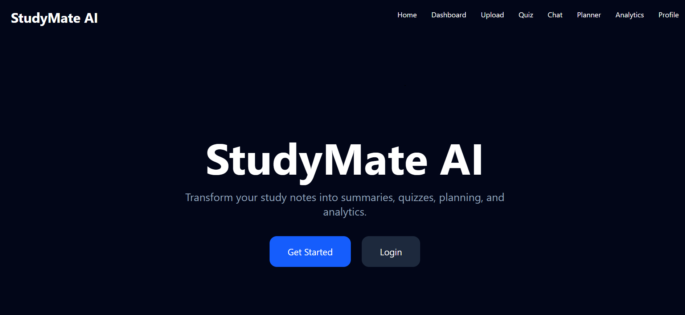
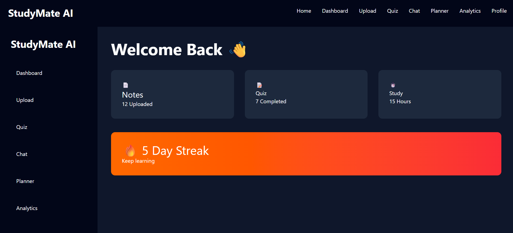
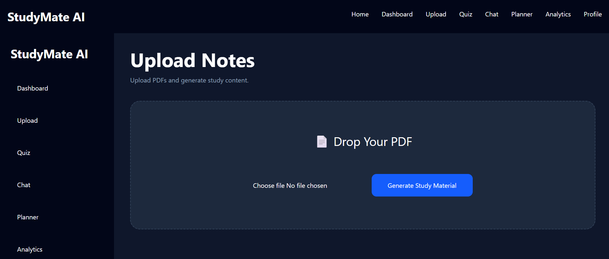
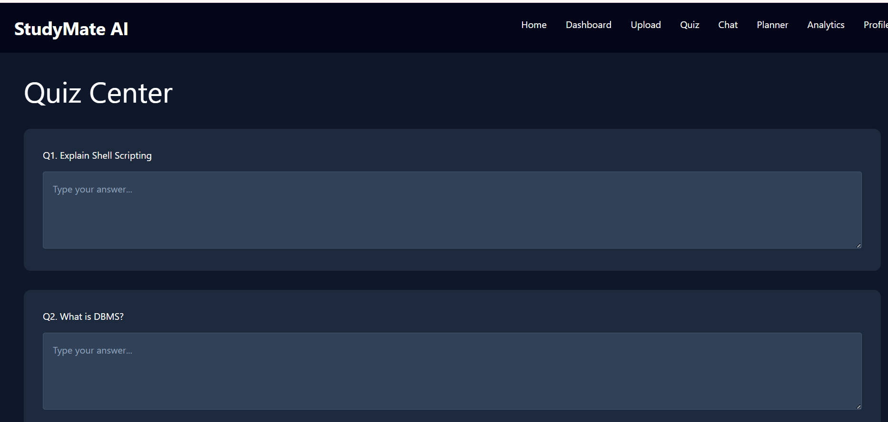

# React + Vite

This template provides a minimal setup to get React working in Vite with HMR and some ESLint rules.

Currently, two official plugins are available:

- [@vitejs/plugin-react](https://github.com/vitejs/vite-plugin-react/blob/main/packages/plugin-react) uses [Oxc](https://oxc.rs)
- [@vitejs/plugin-react-swc](https://github.com/vitejs/vite-plugin-react/blob/main/packages/plugin-react-swc) uses [SWC](https://swc.rs/)

## React Compiler

The React Compiler is not enabled on this template because of its impact on dev & build performances. To add it, see [this documentation](https://react.dev/learn/react-compiler/installation).

## Expanding the ESLint configuration

If you are developing a production application, we recommend using TypeScript with type-aware lint rules enabled. Check out the [TS template](https://github.com/vitejs/vite/tree/main/packages/create-vite/template-react-ts) for information on how to integrate TypeScript and [`typescript-eslint`](https://typescript-eslint.io) in your project.

# 🎓 StudyMate AI

StudyMate AI is an AI-powered student learning platform designed to transform study notes into interactive learning experiences.

Students can upload PDFs, generate summaries, practice quizzes, organize study plans, track progress, and interact through an AI-inspired study environment.

---

## 🚀 Features

### 📄 PDF Upload
Upload study notes and educational PDFs.

### 🧠 Smart Summary
Extract and summarize uploaded documents.

### 📝 Quiz Generation
Generate study questions based on uploaded content.

### 💬 Study Chat
Interact with uploaded notes through a chat interface.

### 📅 Study Planner
Create personalized study schedules.

### 📊 Analytics Dashboard
Track study activity and learning progress.

### 👤 Profile Dashboard
View achievements and study statistics.

### 🌙 Modern UI
Responsive multi-page interface built using React.

---

## 🛠 Tech Stack

### Frontend
- React.js
- React Router
- Tailwind CSS
- Chart.js
- Axios

### Backend
- FastAPI
- Python

### PDF Processing
- PyPDF

### Tools
- Git
- GitHub
- VS Code

---

## 📂 Project Structure

```plaintext
StudyMate-AI/
│
├── frontend/
│   ├── src/
│   │   ├── pages/
│   │   ├── components/
│   │   ├── services/
│
├── backend/
│   ├── app.py
│
└── README.md
```

---

## ⚙ Installation

Clone repository:

```bash
git clone YOUR_REPO_LINK
```

Install frontend:

```bash
cd frontend
npm install
npm run dev
```

Install backend:

```bash
cd backend

python -m venv venv

venv\Scripts\activate

pip install -r requirements.txt

uvicorn app:app --reload
```

---
## 📸 Screenshots

### Home Page



---

### Dashboard



---

### Upload Notes



---

### Quiz



## 🎯 Future Improvements

- AI-powered summarization
- Authentication
- Cloud deployment
- Personalized recommendations
- Mobile support

---

## 💡 Motivation

StudyMate AI was developed to help students study more efficiently through note processing, interactive quizzes, planning, and progress tracking.


⭐ If you like this project, consider starring the repository.